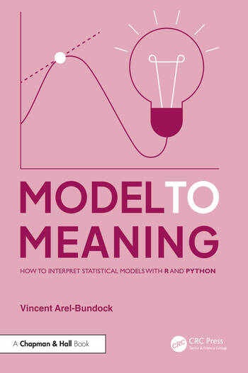

# Model to Meaning: How to use the marginaleffects package to interpret results from statistical or machine learning models

Fri, Aug 8, 2025 - 08:30–12:00
Penn Pavilion Room 1 (107 Union dr.)

> Our world is complex. To make sense of it, data analysts routinely fit sophisticated statistical or machine learning models. Interpreting the results produced by such models can be challenging, and researchers often struggle to communicate their findings to colleagues and stakeholders. This tutorial is designed to bridge that gap. It offers a practical guide to model interpretation for analysts who wish to communicate their results in a clear and impactful way. Tutorial attendees will be introduced to the marginaleffects package and to the conceptual framework that underpins it. The marginaleffects package for R offers a single point of entry for computing and plotting predictions, counterfactual comparisons, slopes, and hypothesis tests for over 100 different types of models. The package provides a simple and unified interface, is well-documented with extensive tutorials, and is model-agnostic—ensuring that users can extract meaningful quantities regardless of the modeling framework they use. The book Model to Meaning: How to Interpret Statistical Results Using marginaleffects for R (forthcoming with CRC Chapman & Hall) introduces a powerful conceptual framework to help analysts make sense of complex models. It demonstrates how to extract meaningful quantities from model outputs and communicate findings effectively using marginaleffects. This tutorial will provide participants with a deep understanding of how to use marginaleffects to improve model interpretation. Attendees will learn how to compute and visualize key statistical summaries, including marginal means, contrasts, and slopes, and how to leverage marginaleffects for hypothesis and equivalence testing. The package follows tidy principles, ensuring that results integrate seamlessly with workflows in R, and with other packages such as ggplot2, Quarto, and modelsummary. This tutorial is suitable for data scientists, researchers, analysts, and students who fit statistical models in R and seek an easy, reliable, and transparent approach to model interpretation. No advanced mathematical background is required, but familiarity with generalized linear models like logistic regression is assumed.

## Code and Software

The Github repository includes two simple scripts that we will use in hands-on portion of the workshop.

Before the workshop, please install the `marginaleffects` and `ggplot2` package in `R`:

```r
install.packages(c("marginaleffects", "ggplot2"))
```

## Article

You can read an article-sized introduction to `marginaleffects` in the (open access) Journal of Statistical Software. The PDF is copied on Github for convenience.

> Arel-Bundock, Greifer, Heiss. 2024. How to interpret statistical models using marginaleffects in R and Python. Journal of Statistical Software. https://doi.org/10.18637/jss.v111.i09

## Book

I just wrote a book on the topic of this workshop. You can read the full text of this book (+ many bonus chapters) for free online: [https://marginaleffects.com.](https://marginaleffects.com)

Paper copies will be available for pre-order on October 17th. CRC Press told me they would have proofs on hand at the UseR! conference hall if you want to leaf through it. 

I pledge to give all author royalties that I receive when people buy the book to [Give Directly](https://www.givedirectly.org/) and the [The Native Women's Shelter of Montreal.](https://www.nwsm.info) If you use the free resources instead, please consider sending a few bucks to one of these organizations. Send me an email to tell me about it; it'll make my day!

> Arel-Bundock, Vincent. Model to Meaning: How to Interpret Statistical Models with R and Python. 1st ed. Chapman & Hall, 2025. https://www.routledge.com/Model-to-Meaning-How-to-Interpret-Statistical-Models-with-R-and-Python/Arel-Bundock/p/book/9781032908724


